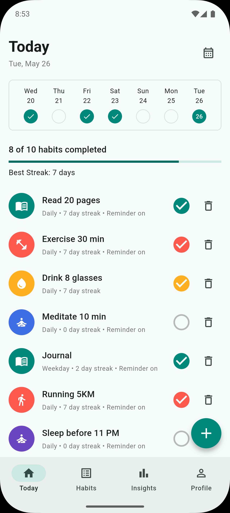
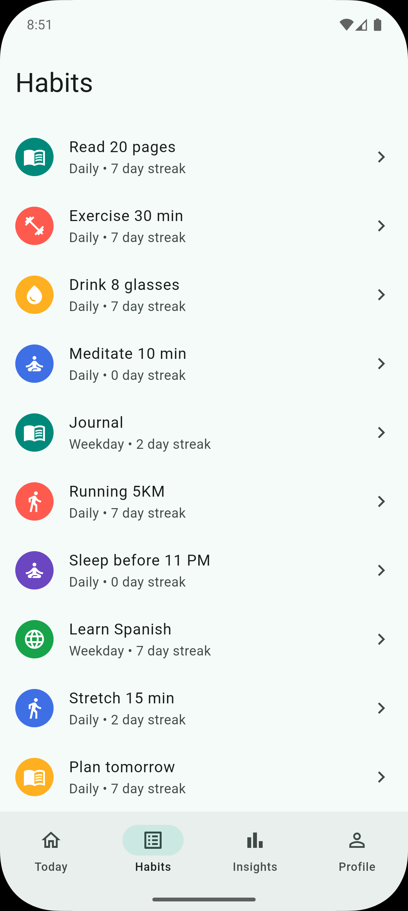
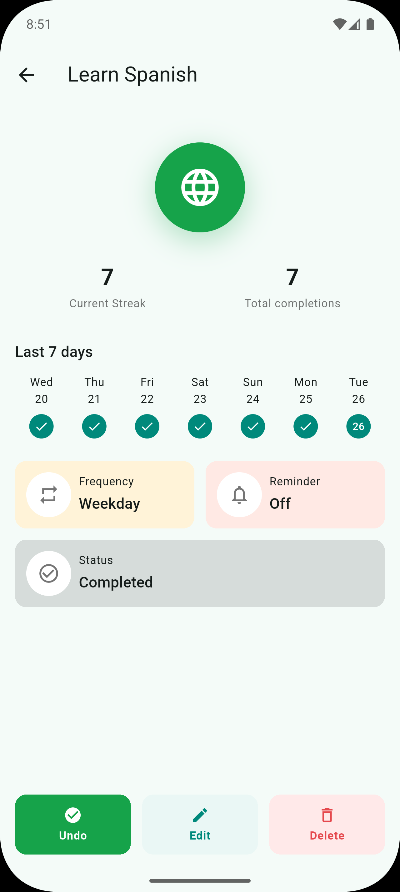
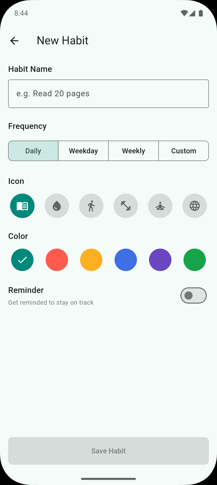
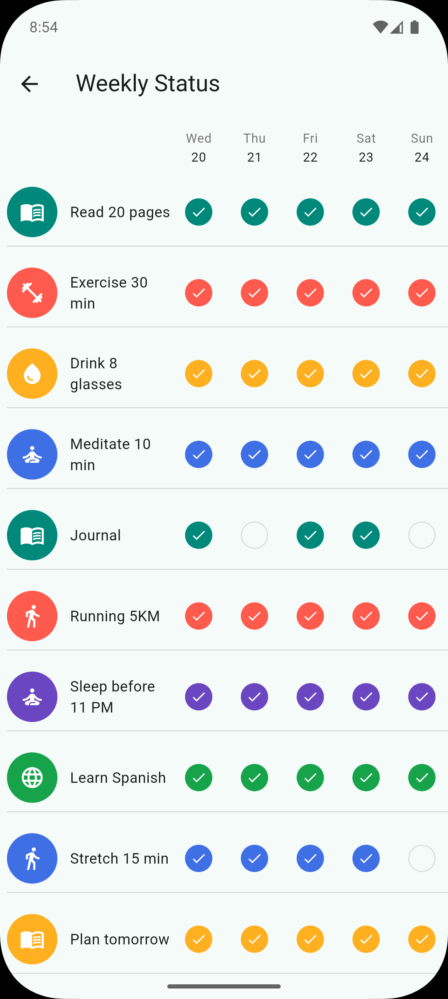
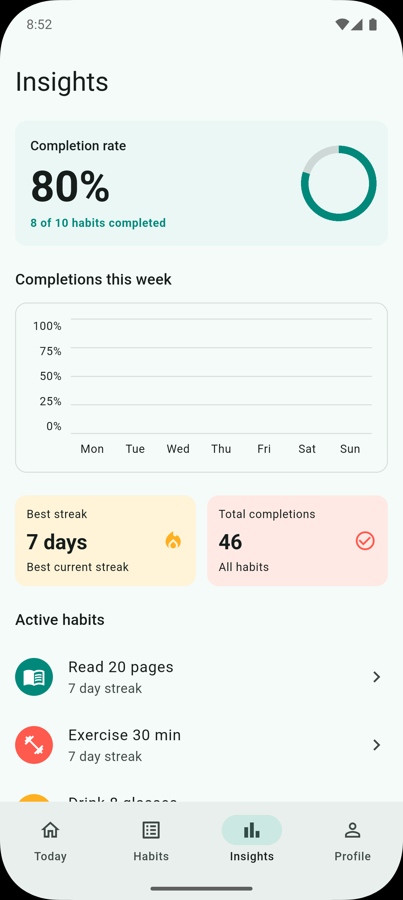
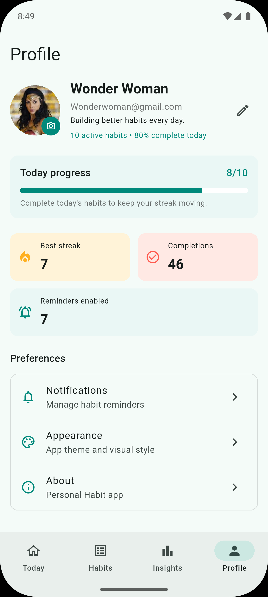
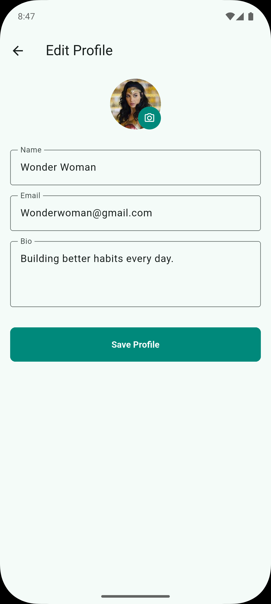

# Personal Habit

A Flutter habit tracker app for practicing daily routines, reminders, weekly progress, and personal profile management.

## Features

- Create, edit, complete, and delete habits.
- Track completed and incomplete status for the last 7 days.
- Toggle any habit status from the Weekly Status screen.
- View today progress, streaks, and completion summaries.
- View insights with weekly completion chart and active habits.
- Schedule local reminder notifications for habits.
- Edit profile base info: name, email, and bio.
- Upload a profile avatar from the device gallery.
- Custom app theme, launcher icon, and native splash screen.

## Tech Stack

- Flutter
- Provider for state management
- SQLite through `sqflite`
- Local notifications through `flutter_local_notifications`
- Avatar upload through `image_picker`
- Persistent app file storage through `path_provider`

## Screens

| Screen | File | Purpose |
| --- | --- | --- |
| App Shell | `lib/features/app_shell/app_shell.dart` | Main tab container with Today, Habits, Insights, and Profile navigation. |
| Today | `lib/features/today/today_screen.dart` | Daily dashboard with today progress, 7-day strip, habit list, completion toggle, delete action, and add habit button. |
| New Habit / Edit Habit | `lib/features/new_habit/new_habit_screen.dart` | Form for creating or editing a habit name, frequency, icon, color, reminder setting, and reminder time. |
| Habit Detail | `lib/features/habit_detail/habit_detail_screen.dart` | Detail view for one habit with icon, streak stats, 7-day completion strip, habit info, complete/edit/delete actions. |
| Habits | `lib/features/habits/habits_screen.dart` | Full habit list screen for opening habit details and managing existing habits. |
| Weekly Status | `lib/features/weekly_status/weekly_status_screen.dart` | 7-day status grid where each habit/date can be toggled completed or incomplete. |
| Insights | `lib/features/insights/insights_screen.dart` | Analytics view with completion rate, weekly chart, stat cards, and active habits. |
| Profile | `lib/features/profile/profile_screen.dart` | User profile dashboard with avatar, base info, progress stats, reminder count, and preferences. |
| Edit Profile | `lib/features/profile/edit_profile_screen.dart` | Form for updating avatar, name, email, and bio. |

## Screen Gallery

| Today | Habits |
| --- | --- |
|  |  |

| Habit Detail | New Habit |
| --- | --- |
|  |  |

| Weekly Status | Insights |
| --- | --- |
|  |  |

| Profile | Edit Profile |
| --- | --- |
|  |  |

## Project Structure

```text
lib/
  controllers/        State controllers for habits and profile
  data/               SQLite database access
  features/           App screens grouped by feature
  models/             Habit, profile, and screen result models
  services/           Notification service
  theme/              App colors, dimensions, and theme
  utils/              Date/time helpers
  widgets/            Shared reusable widgets
```

## Database

The app uses `personal_habit.db` with these main tables:

- `habits`
- `habit_daily_statuses`
- `user_profile`

Habit status history is intentionally limited to the latest 7 days. On app load, the database:

- removes daily status rows older than the rolling 7-day window
- creates missing completed/incomplete rows for active habits
- recalculates today completion and current streaks

## Setup

Install dependencies:

```bash
flutter pub get
```

Run the app:

```bash
flutter run
```

Analyze code:

```bash
flutter analyze
```

Format code:

```bash
dart format .
```

## App Icon And Splash

Source branding assets are in:

```text
assets/branding/
```

Regenerate launcher icons:

```bash
dart run flutter_launcher_icons
```

Regenerate native splash screen:

```bash
dart run flutter_native_splash:create
```

After changing launcher icons or splash resources, fully stop and reinstall the app on the emulator/device if the old icon is cached.

## Emulator Image Upload

To test profile avatar upload on Android Emulator:

1. Drag a `.jpg` or `.png` image from Finder onto the emulator window.
2. Open the app.
3. Go to Profile.
4. Tap the avatar or edit profile avatar.
5. Pick the image from the gallery/files picker.

## Notes

- Reminder notifications require notification permission on supported Android/iOS versions.
- The profile avatar is copied into the app documents directory, and only the saved file path is stored in SQLite.
- If the database schema changes during development, uninstalling the app from the emulator gives a clean local database.
